=====================================
 Split payments for Online ticketing
=====================================

Configuration
-------------

- Main menu -> Website -> Configuration -> Settings

- Go to "Shop - Split Payment" section

- Change following settings for your needs

  * Minimum advance payment (%)

  * Maximum advance payment (%)

  * Minimum advance payment (absolute)

  * Security days

  * Last installment date

Minimum advance payment (absolute) setting
------------------------------------------

- If in shop total payment amount is less then value of this setting,
  then "Split payments" button won't be shown.

- In split payments popup deposit value should comply with value of this setting

Max installment date
--------------------

When customer decides to split payments, in order to limit max number of installements
module makes sure, that max installment date does not exceed following values:

- "Last installmen date" from settings minus security days

- start date of event in cart minus security days

- start date of rental start minus security days

"Split payment" button visibility in payment page
-------------------------------------------------

Split payment is not visible if one condition is true:

- Total payment amount of cart is less than value of "Minimum advance payment (absolute)"

- Max installement date does not exceed 2 weeks

Max tier price
--------------

When splitting payments, original ticket price can be replaced to "max tier price".

For example we have ticket with price 70 and max tier price 100.
Customer wants to buy 1 ticket and chooses split payments.
In this case full payment will be 100 instead of 70.
Additional price will be 30.

To set max tier price:

- Main menu -> Event -> open any event

- In tickets section you can set "Max tier price" for ticket

Invoice creation for downpayments
---------------------------------

Instead of downpayment's product income account, in invoice lines original product accounts are used.

If sale order has products from different accounts, then in downpayments invoices lines are created for every account.

Usage
-----

1) In **Settings -> Website -> Shop – Split payment** configure the
   following:

- **Minimum advance payment (%)** - Minimum percentage of the total
  payment to be paid as an advance.
- **Maximum advance payment (%)** - Maximum percentage of the total
  payment to be paid as an advance.
- **Minimum advance payment (absolute)** - Minimum absolute value of
  total payment to be paid as an advance. Also shopping carts below this
  value won’t show the “split payment” option at checkout.
- **Last installment date** - The latest date that a split payment
  invoice can be created (max allowed date for installments, except
  rental and shuttle products).
- **Installment security days** - If set, it deducts days from the last
  installment date.

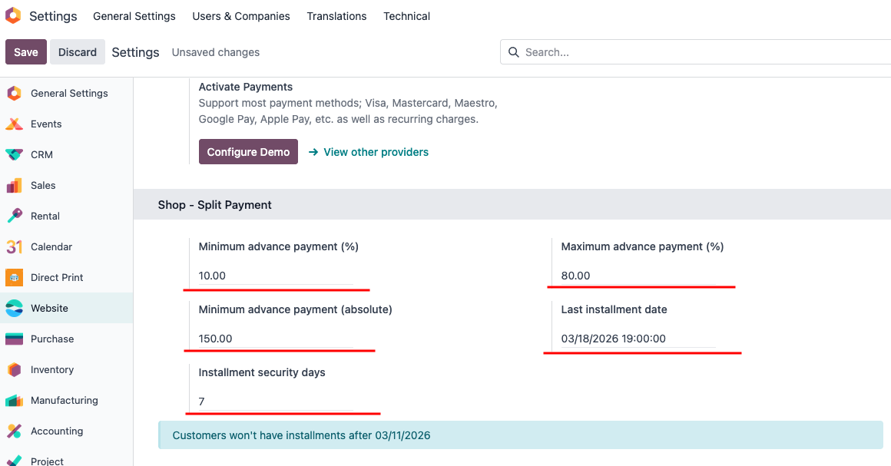

2) On the event's page, configure the "Max Tier Price" for each ticket.
If a ticket is purchased with a split payment, the "Max Tier Price" will be used as the ticket's final price.

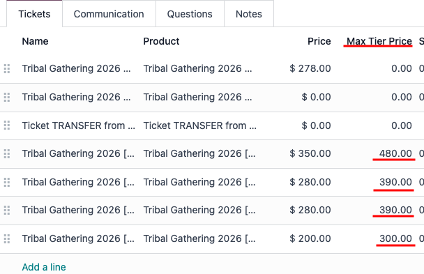

3) Add items to the cart and proceed to the payment, on the payment
   screen press **Split payment**.

   This button won't appear if the following are less than two weeks away (depending on type of the products in the cart and its combination):
   * **Event ticket** - Date of event minus security days
   * **Shuttle ticket + event ticket** - Date of shuttle ticket minus security days
   * **Event ticket + rental product** - Date of event minus security days
   * **Rental product** - Date when rental starts minus security days
   * **All other products** - Last installment date minus security days

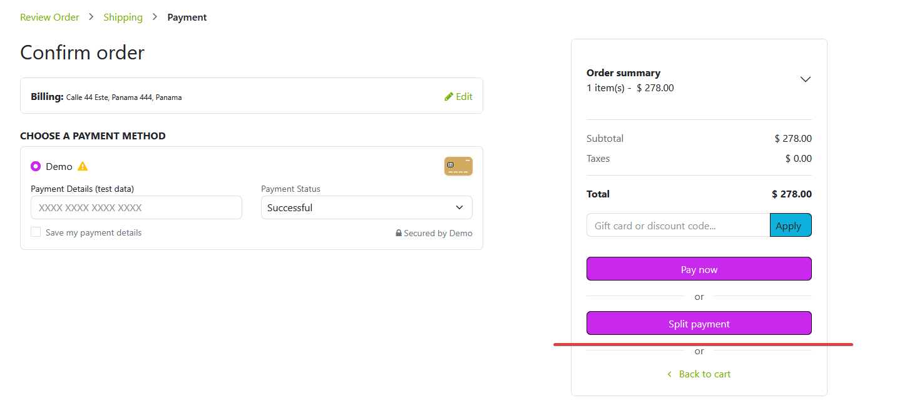

4) A wizard will open with the following fields:

   1. **Initial payment** the amount that customer will pay at checkout,
      as the first payment.
   2. **How many payments** the number of payments the order will be
      split into.
   3. **Period** the frequency of payments (biweekly or monthly).

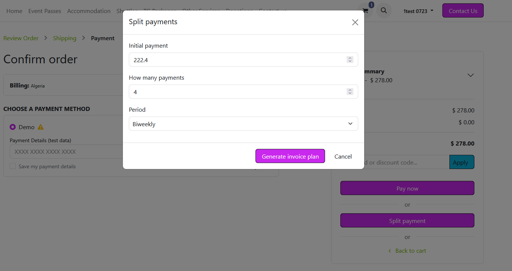

5) After **Generate invoice plan** button is pressed, customer will see
   a generated invoice plan with plan dates and amounts for each
   payment. **Confirm and pay deposit** will redirect customer to the
   invoice with initial payment.

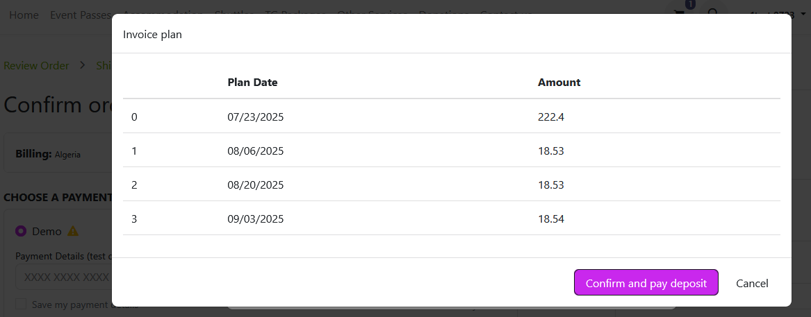
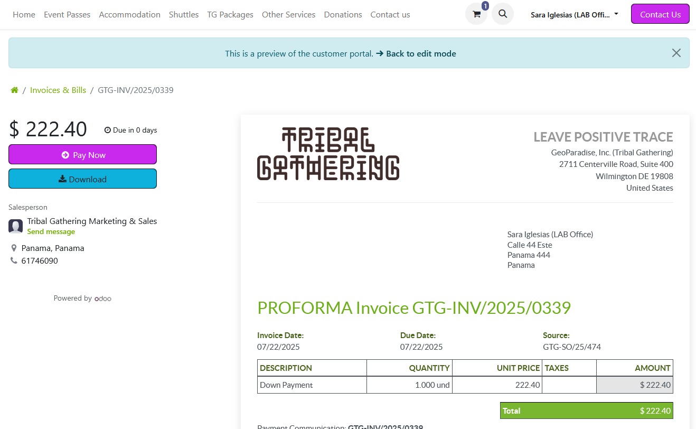

6) Once the invoice for the initial payment is paid, an attendee is
   created for the customer, and all remaining invoices are created.
   Until customer pays all invoices from the payment plan, attendee
   record’s **Is Fully Paid** field will be unchecked and customer’s
   ticket will have the **Partially paid** badge on it.

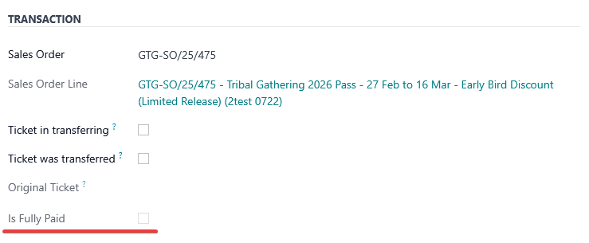
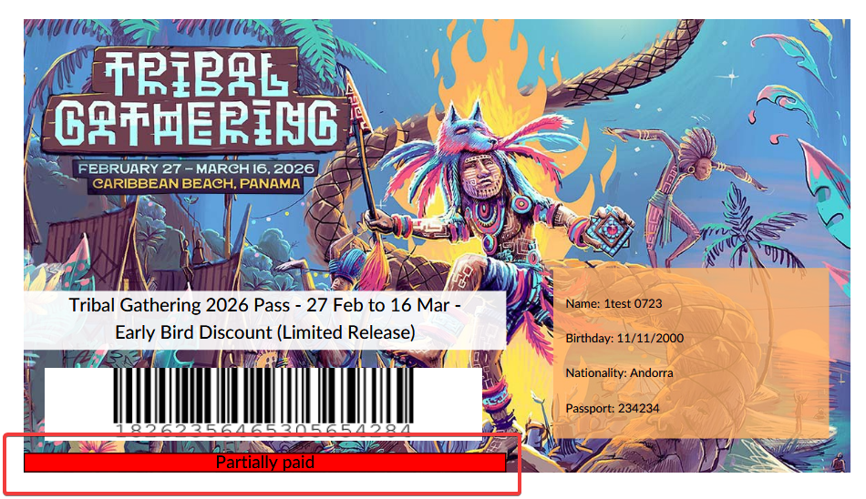

7) This will generate a sale order with the **Use Invoice Plan** field
   checked, with all invoices shown as **Down Payments**. Additionally,
   the Invoice Plan is attached to the chatter.

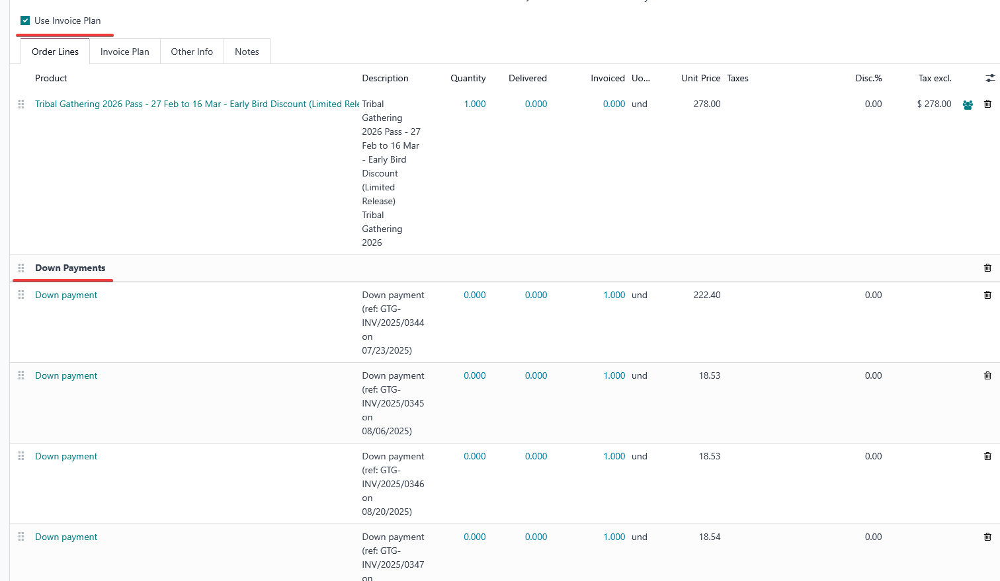
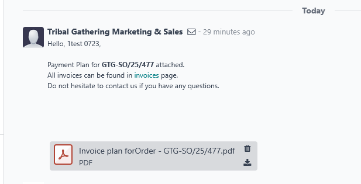

8) Down payment lines on the created split payment invoices will have an account assigned to them based on the category of products.

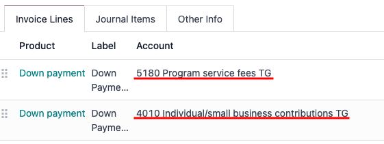

Credits
=======

Contributors
------------

* `Eugene Molotov <https://github.com/em230418>`__

Sponsors
--------

* `Tribal Gathering <https://www.tribalgathering.com/>`__

Maintainers
-----------

* `IT-Projects LLC <https://it-projects.info>`__
